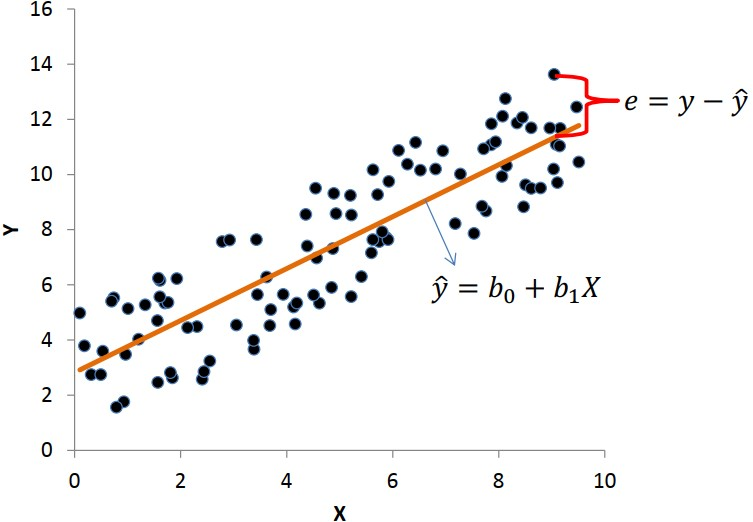
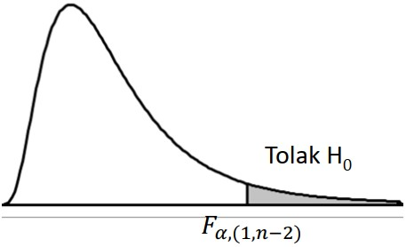
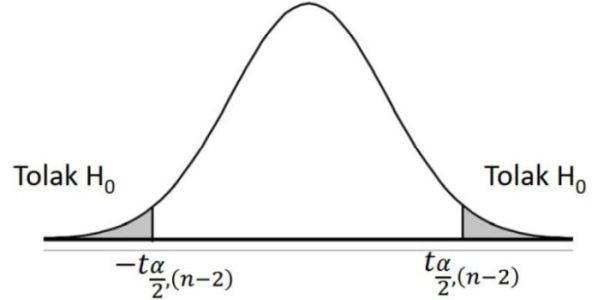

```{r xaringanExtra, echo=FALSE}
xaringanExtra::use_xaringan_extra(c("tile_view", "animate_css", "tachyons"))
```

```{r xaringan-panelset, echo=FALSE}
xaringanExtra::use_panelset()
```

```{r xaringan-scribble, echo=FALSE}
xaringanExtra::use_scribble()
```

```{r xaringan-logo, echo=FALSE}
xaringanExtra::use_logo(
  image_url = "Unsera.png"
)
```

```{r xaringanExtra-webcam, echo=FALSE}
xaringanExtra::use_webcam()
```

```{r xaringanExtra-search, echo=FALSE}
xaringanExtra::use_search(show_icon = TRUE)
```


.pull-left[
<br><br><br><br><br><br><br>


]

.pull-right[
<br>
# **.purple[Outline]**

- ##Pendahuluan
- ##Korelasi
- ##Uji Hipotesis untuk Korelasi

]

---

.pull.center[

## **Pendahuluan**

### Hubungan Antara 2 Peubah atau Lebih

| PEUBAH    | KASUS   | PENGUMPULAN DATA    | JENIS HUBUNGANNYA |
|:--        |:--      | :--                 |:--                |
|1. Dosis Pupuk <br> 2. Banyaknya padi yang dihasilkan | Diduga dosis pupuk mempengaruhi banyaknya padi yang dihasilkan/ha | Dosis pupuk ditentukan dahulu, faktor-faktor lain yg mempengaruhi banyaknya padi dikendalikan sehingga pengaruhnya konstan, kemudian diamati banyaknya padi yang dihasilkan | Perubahan banyaknya padi yg dihasilkan/ha dipengaruhi oleh perubahan dosis pupuk $\rightarrow$ **HUB SEBAB AKIBAT** |
|1. Tinggi badan <br> 2. Berat badan | Diduga tinggi badan dan berat badan memiliki hubungan | Dimulai dengan mengamati tinggi badan dahulu, disusul mengamati peubah yang dianggap relevan (berat badan), atau sebaliknya.| Pengamatan thdp kedua peubah dilakukan secara bersamaan. Sulit untuk mengatakan bahwa perubahan satu peubah disebabkan oleh perubahan peubah lainnya <br> $\rightarrow$ **bukan HUB SEBAB AKIBAT** Ingin diketahui kekuatan dan arah hubungannya|

]

---

.pull.center[

## **Pendahuluan**

| PEUBAH    | KASUS   | PENGUMPULAN DATA    | JENIS HUBUNGANNYA |
|:--        |:--      | :--                 |:--                |
|1. Banyaknya barang terjual/minggu <br> 2. Adanya hari libur/tidak <br> 3. Harga barang | Diduga banyaknya barang terjual/minggu dipengaruhi oleh berbagai peubah, misalnya harga barang, ada/ tidaknya hari libur dlm minggu tsb | Harga barang ditentukan lebih dahulu, faktor-faktor lain yg mempengaruhi banyaknya barang terjual dikendalikan sehingga pengaruhnya konstan, kemudian diamati banyaknya barang yg terjual pada minggu ada hari libur dan minggu tanpa hari libur | Perubahan banyaknya barang yg terjual dipengaruhi oleh perubahan harga dan ada/tidaknya hari libur <br> $\rightarrow$ **Hub SEBAB AKIBAT** |
|1. Bobot badan <br> 2. Bobot jantung | Diduga bobot badan dan bobot jantung memiliki hubungan | Dimulai dengan mengamati bobot badan terlebih dahulu, segera disusul mengamati peubah yg dianggap relevan (dalam hal ini bobot jantung), atau sebaliknya. | Pengamatan thdp kedua peubah dilakukan secara bersamaan. Sulit untuk mengatakan bahwa perubahan satu peubah disebabkan oleh peubah lainnya. <br> $\rightarrow$ **bukan SEBAB AKIBAT**. Ingin diketahui model matematisnya (HUB KUANTITATIF)    |

]


---

.pull.center[

## **Pendahuluan**

]

.pull-left[

###**Analisis Regresi**

Analisis statistika yang memanfaatkan **hubungan sebab akibat** antara dua atau lebih peubah kuantitatif sehingga salah satu peubah dapat diramalkan dari peubah lainnya.

**Peubah $X$ **: peubah bebas/peubah penjelas / peubah independen (**yang mempengaruhi**)

**Peubah $Y$ **: peubah terikat/ peubah tak bebas/ peubah respon/ peubah dependen (**yang dipengaruhi**)


]

.pull-right[

### **Regresi .red[Linear] .green[Sederhana]**

- ### .red[**Linear**]<br>Linear dalam parameter


- ### .green[**Sederhana**] <br> Hanya satu peubah penjelas (peubah $X$)


]

---


.pull.center[

## **Analisis Regresi: Regresi Linear Sederhana**

]

.pull-left[

.red[**Relationship**]

|              | Numerik                    | Kategorik                      |
| :-:          | :--:                       | :--:                           |
| Numerik      | Korelasi Pearson, Spearman | Tabel Ringkasan                |
| Kategorik    | Tabel Ringkasan            | Spearman (ordinal), Chi Square |


.red[**Causal relationship**]

|                    | $X$ : Numerik      | $X$ : Kategorik  |
| :-:                | :--:               | :--:             |
| $Y$ : Numerik      | .blue[**Regresi Linier**]     | ANOVA            |
| $Y$ : Kategorik    | Regresi Logistik   | Regresi Logistik |


]

.pull-right[

### **Hubungan Antar Peubah:**
- Fungsional (deterministik) $\rightarrow Y=f(X)$ <br> _Misalnya_: $Y=2X$

- Statistik (stokastik) $\rightarrow$ amatan tidak jatuh pas pada kurva (terdapat
galat atau error) <br>
_Misalnya_: IQ vs Prestasi, Berat vs Tinggi, Dosis Pupuk vs Produksi

]
---

.pull.center[

## **Analisis Regresi: Regresi Linear Sederhana**

]

.pull-left[

### .red[**Model**] Regresi Linear Sederhana

### $$Y_i=\beta_0+\beta_1X_i+\epsilon_i$$

### dengan <br> $i=1,2,3,\dots,n$ <br> $Y_i:$ peubah respons ke - $i$ <br> $X_i:$ peubah penjelas ke - $i$ <br> $\beta_0:$ Intersep <br> $\beta_1:$ Gradien (kemiringan) <br> $\epsilon_i:$ Galat/error

]

.pull-right[

### .green[**Persamaan**] Regresi Linear Sederhana

### $$\hat{Y}_i=b_0+b_1X_i$$

### dengan <br> $i=1,2,3,\dots,n$ <br> $\hat{Y}_i:$ dugaan peubah respons ke - $i$ <br> $X_i:$ peubah penjelas ke - $i$ <br> $b_0:$ penduga untuk $\beta_0$ <br> $b_1:$ penduga untuk $\beta_1$

]

---

.pull.center[

## **Analisis Regresi: Regresi Linear Sederhana**


### $$Y_i=\beta_0+\beta_1X_i+\epsilon_i \xrightarrow{\text{diduga oleh}} \hat{Y}_i=b_0+b_1X_i$$


]

---

.pull.center[

## **Analisis Regresi: Regresi Linear Sederhana**

]

.pull-left[

$$Y_i=\beta_0+\beta_1X_i+\epsilon_i \xrightarrow{\text{diduga oleh}} \hat{Y}_i=b_0+b_1X_i$$

### $$\beta_0 \xrightarrow{\text{diduga oleh}} b_0$$

### $$\beta_1 \xrightarrow{\text{diduga oleh}} b_1$$

# .red[$$\text{Interpretasi?}$$]

]

.pull-right[


]

---

.pull.center[

## **Analisis Regresi: Regresi Linear Sederhana**

]

.pull-left[


]


.pull-right[

### $b_0$ adalah nilai rataan $Y$ ketika $X=0$ (tidak dapat diinterpretasikan oleh $X$)

### $b_1$ adalah perubahan nilai rataan $Y$ untuk setiap perubahan 1 satuan $X$.

]


---

.pull.center[

## **Analisis Regresi: Regresi Linear Sederhana**

]

.pull-left[

### The Baseline Model: $Y=\beta_0+\epsilon$


]

.pull-right[

### Metode Kuadrat Terkecil (.red[Meminimumkan jumlah kuadrat galat/error])

 

]

---

.pull.center[

## **Pendugaan Parameter**

]

.pull-left[

### Pendugaan terhadap koefisien regresi dengan metode kuadrat terkecil

- $\beta_1$ diduga oleh $b_1$

$$b_1=\dfrac{\text{JK}_{XY}}{\text{JK}_{XX}}=\dfrac{n\sum x_iy_i-\sum x_i \sum y_i}{n\sum x^2_i-(\sum x_i)^2}$$

- $\beta_0$ diduga oleh $b_0=\bar{Y}-b_1X$

- Persamaan regresi:

$$\hat{Y}=b_0+b_1X$$


]

.pull-right[

### Keragamaman yang dapat dijelaskan dan tidak dapat dijelaskan


]

---

.pull.center[

## **Uji Hipotesis**

]

.pull-left[


### Uji simultan (bersama) $\rightarrow$ Uji F
- Uji apakah model tersebut sesuai/pas?

- Dengan tabel ANOVA

### Uji parsial (per koefisien) $\rightarrow$ Uji t
- Uji apakah peubah penjelas mempengaruhi peubah respon?


]

.pull-right[

### Uji simultan (bersama) $\rightarrow$ Uji F

- Uji apakah model tersebut sesuai/pas?

  - Hipotesis : <br>
    $H0 : \beta_1 = 0$ ( model tidak sesuai/pas) <br>
    $H1 : \beta_1 \ne 0$ ( model sesuai/pas)
    
  - Statistik Uji
  
  $$F_0=\dfrac{\text{KTR}}{\text{KTG}}$$


]


---

.pull.center[

### **Uji Hipotesis**

]

.pull-left[

### ANOVA

| Sumber    | db   | Jumlah Kuadrat (JK)    | Kuadrat Tengah (KT)    | $F_0$ |
|:--        |:--:   | :--  | :--  | :--  |
| Regresi   | 1     | $\text{JKR}=b_1\text{JK}_{XX}$  | $\text{KTR}=\text{JKR}/1$ | $\text{KTR}/\text{KTG}$ |
| Galat     | $n-2$ | $\text{JKG}=\text{JKT}-\text{JKR}$  | $\text{KTG}=\text{JKG}/(n-2)$ |   |
| Total     | $n-1$ | $JKT=\text{JK}_{XY}$  |   |   |

$\text{JK}_{XY}=\sum x_i y_i-\dfrac{\sum x_i \sum y_i}{n}$

$\text{JK}_{XX}=\sum x^2_i-\dfrac{(\sum x_i)^2}{n}$

]


---

.pull.center[

### **Uji Hipotesis**

]

.pull-left[

- Titik Kritis $\rightarrow$ $F_{\alpha,(1,n-2)}$

- Daerah penolakan $H_0$



- Kesimpulan <br>
  Tolak $H_0 \rightarrow$ Cukup bukti untuk menyatakan bahwa model tersebut
sesuai/pas pada taraf nyata $\alpha$

]

.pull-right[

### Uji parsial (per koefisien) $\rightarrow$ Uji t

- Uji apakah peubah penjelas mempengaruhi peubah respon?

  - Hipotesis : <br>
    $H0 : \beta_1 = 0$ $(X$ tidak mempengaruhi $Y)$ <br>
    $H1 : \beta_1 \ne 0$ $(X$ mempengaruhi $Y)$
    
  - Statistik Uji
  
  $$t_0=(b_1-\beta_1)\sqrt{\dfrac{\text{JK}_{XX}}{\text{KTR}}}$$
  - Titik kritis
  
]

---


---


---


---


---


.pull-left[
### Wilayah Penolakan $H_0$ (uji dua arah)





### Kesimpulan
Tolak $H_0$ : Cukup bukti untuk menyatakan bahwa ada korelasi antara $X$ dengan $Y$ pada taraf nyata $\alpha$

]

.pull-right[

<br><br><br>
**Latihan 1**

Dari data pada contoh di slide 12, ujilah hipotesis apakah terdapat korelasi yang signifikan antara tinggi dengan bobot badan pada $\alpha=5\%$

___

**Latihan 2**

Seorang dosen berpendapat bahwa ada hubungan yang positif antara IQ mahasiswa dengan hasil UAS Statistika. Untuk menguji pendapatnya, 6 orang mahasiswa dipilih secara acak dan diperoleh data berikut.

| IQ | 110 | 120 | 125 | 130 | 130 | 140 |
| :--: | :--: | :--: | :--: | :--: | :--: | :--: |
| UAS | 90 | 80 | 90 | 95 | 85 | 95 |

Ujilah pendapat dosen tersebut dengan taraf nyata $5\%$.

]
---

.pull-left[

**Latihan 1**

Dari data pada contoh di atas, ujilah hipotesis apakah terdapat korelasi yang signifikan antara tinggi dengan bobot badan pada $\alpha=5\%$

___

**Latihan 2**

Seorang dosen berpendapat bahwa ada hubungan yang positif antara IQ mahasiswa dengan hasil UAS Statistika. Untuk menguji pendapatnya, 6 orang mahasiswa dipilih secara acak dan diperoleh data berikut.

| IQ | 110 | 120 | 125 | 130 | 130 | 140 |
| :--: | :--: | :--: | :--: | :--: | :--: | :--: |
| UAS | 90 | 80 | 90 | 95 | 85 | 95 |

Ujilah pendapat dosen tersebut dengan taraf nyata $5\%$.

]

.pull-right[

**Latihan 3**

Diketahui tabel berikut.

| Tahun | Ekspor | PDB | Investasi |
| :--: | :--: | :--: | :--: |
| 1976 | 7.4 | 15.5 | 2.6 |
| 1977 | 7.1 | 19.0 | 3.2 |
| 1978 | 8.5 | 22.8 | 3.7 |
| 1979 | 10.8 | 32.0 | 4.7 |
| 1980 | 11.6 | 45.4 | 6.7 |
| 1981 | 15.6 | 54.0 | 9.5 |
| 1982 | 24.0 | 59.6 | 11.5 |
| 1983 | 25.2 | 61.4 | 13.5 |
| 1984 | 22.3 | 86.1 | 19.0 |
| 1985 | 21.1 | 92.8 | 19.3 |
| 1986 | 21.9 | 95.3 | 19.6 |

Tentukan pasangan peubah `Ekspor`, `PDB`, dan `Investasi` yang memiliki korelasi paling kuat.

]


---

class: inverse, center, middle

# Thank you!
# See you next week

