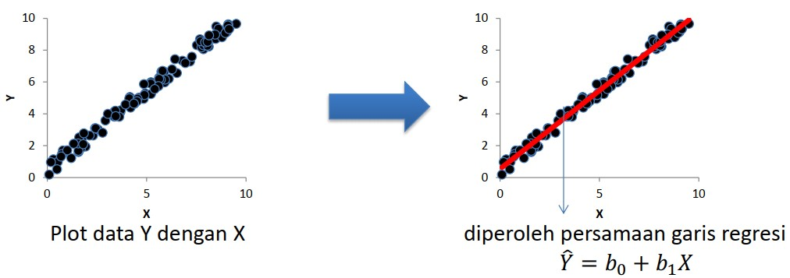
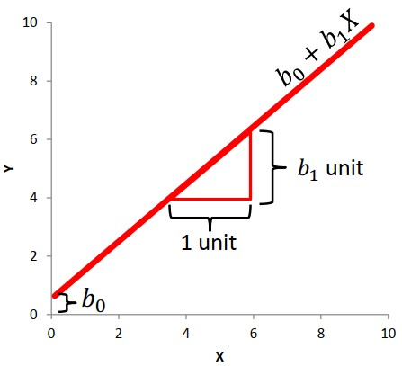
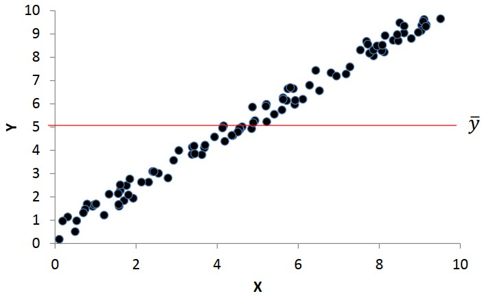
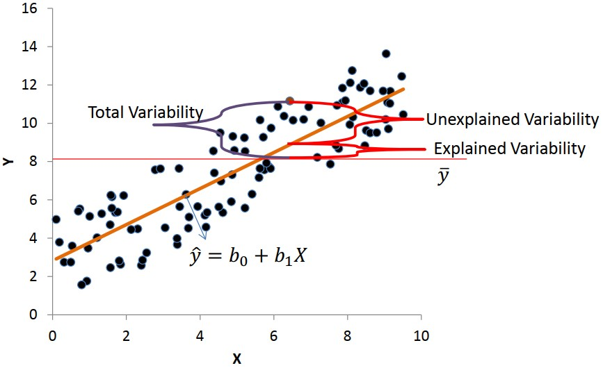

```{r xaringanExtra, echo=FALSE}
xaringanExtra::use_xaringan_extra(c("tile_view", "animate_css", "tachyons"))
```

```{r xaringan-panelset, echo=FALSE}
xaringanExtra::use_panelset()
```

```{r xaringan-scribble, echo=FALSE}
xaringanExtra::use_scribble()
```

```{r xaringan-logo, echo=FALSE}
xaringanExtra::use_logo(
  image_url = "Unsera.png"
)
```

```{r xaringanExtra-webcam, echo=FALSE}
xaringanExtra::use_webcam()
```

```{r xaringanExtra-search, echo=FALSE}
xaringanExtra::use_search(show_icon = TRUE)
```


.pull-left[
<br><br><br><br><br><br><br>


]

.pull-right[
<br>
# **.purple[Outline]**

- ##Pendahuluan
- ##Analisis Regresi
- ##Uji Hipotesis untuk Regresi

]

---

.pull.center[

## **Pendahuluan**

#### Hubungan Antara 2 Peubah atau Lebih

| PEUBAH    | KASUS   | PENGUMPULAN DATA    | JENIS HUBUNGANNYA |
|:--        |:--      | :--                 |:--                |
|1. Dosis Pupuk <br> 2. Banyaknya padi yang dihasilkan | Diduga dosis pupuk mempengaruhi banyaknya padi yang dihasilkan/ha | Dosis pupuk ditentukan dahulu, faktor-faktor lain yg mempengaruhi banyaknya padi dikendalikan sehingga pengaruhnya konstan, kemudian diamati banyaknya padi yang dihasilkan | Perubahan banyaknya padi yg dihasilkan/ha dipengaruhi oleh perubahan dosis pupuk $\rightarrow$ .red[**HUB SEBAB AKIBAT**] |
|1. Tinggi badan <br> 2. Berat badan | Diduga tinggi badan dan berat badan memiliki hubungan | Dimulai dengan mengamati tinggi badan dahulu, disusul mengamati peubah yang dianggap relevan (berat badan), atau sebaliknya.| Pengamatan thdp kedua peubah dilakukan secara bersamaan. Sulit untuk mengatakan bahwa perubahan satu peubah disebabkan oleh perubahan peubah lainnya <br> $\rightarrow$ .red[**bukan HUB SEBAB AKIBAT**] Ingin diketahui kekuatan dan arah hubungannya|

]

---

.pull.center[

## **Pendahuluan**

| PEUBAH    | KASUS   | PENGUMPULAN DATA    | JENIS HUBUNGANNYA |
|:--        |:--      | :--                 |:--                |
|1. Banyaknya barang terjual/minggu <br> 2. Adanya hari libur/tidak <br> 3. Harga barang | Diduga banyaknya barang terjual/minggu dipengaruhi oleh berbagai peubah, misalnya harga barang, ada/ tidaknya hari libur dlm minggu tsb | Harga barang ditentukan lebih dahulu, faktor-faktor lain yg mempengaruhi banyaknya barang terjual dikendalikan sehingga pengaruhnya konstan, kemudian diamati banyaknya barang yg terjual pada minggu ada hari libur dan minggu tanpa hari libur | Perubahan banyaknya barang yg terjual dipengaruhi oleh perubahan harga dan ada/tidaknya hari libur <br> $\rightarrow$ .red[**Hub SEBAB AKIBAT**] |
|1. Bobot badan <br> 2. Bobot jantung | Diduga bobot badan dan bobot jantung memiliki hubungan | Dimulai dengan mengamati bobot badan terlebih dahulu, segera disusul mengamati peubah yg dianggap relevan (dalam hal ini bobot jantung), atau sebaliknya. | Pengamatan thdp kedua peubah dilakukan secara bersamaan. Sulit untuk mengatakan bahwa perubahan satu peubah disebabkan oleh peubah lainnya. <br> $\rightarrow$ .red[**bukan SEBAB AKIBAT**]. Ingin diketahui model matematisnya (HUB KUANTITATIF)    |

]


---

.pull.center[

## **Pendahuluan**

]

.pull-left[

###**Analisis Regresi**

Analisis statistika yang memanfaatkan **hubungan sebab akibat** antara dua atau lebih peubah kuantitatif sehingga salah satu peubah dapat diramalkan dari peubah lainnya.

**Peubah $X$ **: peubah bebas/peubah penjelas / peubah independen (**yang mempengaruhi**)

**Peubah $Y$ **: peubah terikat/ peubah tak bebas/ peubah respon/ peubah dependen (**yang dipengaruhi**)


]

--

.pull-right[

### **Regresi .red[Linear] .green[Sederhana]**

- ### .red[**Linear**]<br>Linear dalam parameter


- ### .green[**Sederhana**] <br> Hanya satu peubah penjelas (peubah $X$)


]

---


.pull.center[

## **Analisis Regresi: Regresi Linear Sederhana**

]

.pull-left[

.red[**Relationship**]

|              | Numerik                    | Kategorik                      |
| :-:          | :--:                       | :--:                           |
| Numerik      | Korelasi Pearson, Spearman | Tabel Ringkasan                |
| Kategorik    | Tabel Ringkasan            | Spearman (ordinal), Chi Square |


.red[**Causal relationship**]

|                    | $X$ : Numerik      | $X$ : Kategorik  |
| :-:                | :--:               | :--:             |
| $Y$ : Numerik      | .blue[**Regresi Linier**]     | ANOVA            |
| $Y$ : Kategorik    | Regresi Logistik   | Regresi Logistik |


]

.pull-right[

### **Hubungan Antar Peubah:**
- Fungsional (deterministik) $\rightarrow Y=f(X)$ <br> _Misalnya_: $Y=2X$

- Statistik (stokastik) $\rightarrow$ amatan tidak jatuh pas pada kurva (terdapat
galat atau error) <br>
_Misalnya_: IQ vs Prestasi, Berat vs Tinggi, Dosis Pupuk vs Produksi

]
---

.pull.center[

## **Analisis Regresi: Regresi Linear Sederhana**

]

.pull-left[

### .red[**Model**] Regresi Linear Sederhana

### $$Y_i=\beta_0+\beta_1X_i+\epsilon_i$$

### dengan <br> $i=1,2,3,\dots,n$ <br> $Y_i:$ peubah respons ke - $i$ <br> $X_i:$ peubah penjelas ke - $i$ <br> $\beta_0:$ Intersep <br> $\beta_1:$ Gradien (kemiringan) <br> $\epsilon_i:$ Galat/error

]

--

.pull-right[

### .green[**Persamaan**] Regresi Linear Sederhana

### $$\hat{Y}_i=b_0+b_1X_i$$

### dengan <br> $i=1,2,3,\dots,n$ <br> $\hat{Y}_i:$ dugaan peubah respons ke - $i$ <br> $X_i:$ peubah penjelas ke - $i$ <br> $b_0:$ penduga untuk $\beta_0$ <br> $b_1:$ penduga untuk $\beta_1$

]

---

.pull.center[

## **Analisis Regresi: Regresi Linear Sederhana**



### $$Y_i=\beta_0+\beta_1X_i+\epsilon_i \xrightarrow{\text{diduga oleh}} \hat{Y}_i=b_0+b_1X_i$$


]

---

.pull.center[

## **Analisis Regresi: Regresi Linear Sederhana**

]

.pull-left[

$$Y_i=\beta_0+\beta_1X_i+\epsilon_i \xrightarrow{\text{diduga oleh}} \hat{Y}_i=b_0+b_1X_i$$

### $$\beta_0 \xrightarrow{\text{diduga oleh}} b_0$$

### $$\beta_1 \xrightarrow{\text{diduga oleh}} b_1$$

# .red[$$\text{Interpretasi?}$$]

]

--

.pull-right[



]

---

.pull.center[

## **Analisis Regresi: Regresi Linear Sederhana**

]

.pull-left[


]


.pull-right[

### $b_0$ adalah nilai rataan $Y$ ketika $X=0$ (tidak dapat diinterpretasikan oleh $X$)

### $b_1$ adalah perubahan nilai rataan $Y$ untuk setiap perubahan 1 satuan $X$.

]


---

.pull.center[

## **Analisis Regresi: Regresi Linear Sederhana**

]

.pull-left[

### The Baseline Model: $Y=\beta_0+\epsilon$



]

--

.pull-right[

### Metode Kuadrat Terkecil (.red[Meminimumkan jumlah kuadrat galat/error])

 

]

---

.pull.center[

## **Pendugaan Parameter**

]

.pull-left[

### Pendugaan terhadap koefisien regresi dengan metode kuadrat terkecil

- $\beta_1$ diduga oleh $b_1$

$$b_1=\dfrac{\text{JK}_{XY}}{\text{JK}_{XX}}=\dfrac{n\sum x_iy_i-\sum x_i \sum y_i}{n\sum x^2_i-(\sum x_i)^2}$$

- $\beta_0$ diduga oleh $b_0=\bar{Y}-b_1X$

- Persamaan regresi:

$$\hat{Y}=b_0+b_1X$$


]

--

.pull-right[

### Keragamaman yang dapat dijelaskan dan tidak dapat dijelaskan




]

---

.pull.center[

## **Uji Hipotesis**

]

.pull-left[


### Uji simultan (bersama) $\rightarrow$ Uji F
- Uji apakah model tersebut sesuai/pas?

- Dengan tabel ANOVA

### Uji parsial (per koefisien) $\rightarrow$ Uji t
- Uji apakah peubah penjelas mempengaruhi peubah respon?


]

--

.pull-right[

### Uji simultan (bersama) $\rightarrow$ Uji F

- Uji apakah model tersebut sesuai/pas?

  - Hipotesis : <br>
    $H0 : \beta_1 = 0$ ( model tidak sesuai/pas) <br>
    $H1 : \beta_1 \ne 0$ ( model sesuai/pas)
    
  - Statistik Uji
  
  $$F_0=\dfrac{\text{KTR}}{\text{KTG}}$$


]


---

.pull.center[

### **Uji Hipotesis**

]

.pull-left[

### ANOVA

| Sumber    | db   | Jumlah Kuadrat (JK)    | Kuadrat Tengah (KT)    | $F_0$ |
|:--        |:--:   | :--  | :--  | :--  |
| Regresi   | 1     | $\text{JKR}=b_1\text{JK}_{XY}$  | $\text{KTR}=\text{JKR}/1$ | $\text{KTR}/\text{KTG}$ |
| Galat     | $n-2$ | $\text{JKG}=\text{JKT}-\text{JKR}$  | $\text{KTG}=\text{JKG}/(n-2)$ |   |
| Total     | $n-1$ | $\text{JKT}=\text{JK}_{YY}$  |   |   |

$\text{JK}_{XY}=\sum x_i y_i-\dfrac{\sum x_i \sum y_i}{n}$

$\text{JK}_{YY}=\sum y^2_i-\dfrac{(\sum y_i)^2}{n}$

]

---

.pull.center[

### **Uji Hipotesis**

]

.pull-left[

- Titik Kritis $\rightarrow$ $F_{\alpha,(1,n-2)}$

- Daerah penolakan $H_0$


- Kesimpulan <br>
  Tolak $H_0 \rightarrow$ Cukup bukti untuk menyatakan bahwa model tersebut
sesuai/pas pada taraf nyata $\alpha$

]

--

.pull-right[

### Uji parsial (per koefisien) $\rightarrow$ Uji t

- Uji apakah peubah penjelas mempengaruhi peubah respon?

  - Hipotesis : <br>
    $H0 : \beta_1 = 0$ $(X$ tidak mempengaruhi $Y)$ <br>
    $H1 : \beta_1 \ne 0$ $(X$ mempengaruhi $Y)$
    
  - Statistik Uji
  
  $$t_0=(b_1-\beta_1)\sqrt{\dfrac{\text{JK}_{XX}}{\text{KTG}}}$$
  - Titik kritis
  $$t_{\frac{\alpha}{2},(n-2)}$$
  
]

---

.pull.center[

### **Uji Hipotesis**

]

.pull-left[

- Wilayah penolakan $H_0$
  
  

- Kesimpulan <br>
  Tolak $H_0 \rightarrow$  Cukup bukti untuk menyatakan bahwa $X$ mempengaruhi $Y$ secara linear pada taraf nyata $\alpha$

]

--

.pull-right[

### Koefisien Determinasi $(R^2)$

### $$R^2=\dfrac{\text{JKR}}{\text{JKT}}\times100\%$$

.red[**Interpretasi**] : sebesar $R^2$ keragaman $Y$ mampu dijelaskan
oleh $X$, sedangkan sisanya $(100-R^2)\%$ dijelaskan oleh faktor lain
yang tidak dimasukkan dalam model

Dalam regresi linear sederhana:
$$(r)^2=R^2$$

]

---

.pull-left[

**Contoh**

Promosi penjualan untuk suatu produk diduga mempengaruhi besar kecilnya penjualan dari produk tersebut. Untuk menguji dugaan tersebut, dipilih 5 buah produk secara acak dan diperoleh data sebagai berikut.

| $X$ | 1 | 2 | 4 | 6 | 7 |
|:--: |:--: |:--: |:--: |:--: |:--: |
| $Y$ | 3 | 5 | 7 | 8 | 10 |

di mana:<br>
$X:$ % kenaikan biaya promosi dalam setahun<br>
$Y:$ % kenaikan penjualan selama setahun

Tentukan:<br>
- Peubah respon dan peubah penjelas
- Apakah model regresi linear sesuai pada $\alpha=5\%$?
- Apakah variabel $Y$ mampu dijelaskan oleh variabel $X$ pada $\alpha=5\%$?
- Koefisien determinasi
- Prediksi penjualan jika biaya promosi dinaikan sebesar 5%.

]

--

.pull-right[

- Peubah respon: **% kenaikan penjualan selama setahun $(Y)$** <br>
  Peubah penjelas: **% kenaikan biaya promosi dalam setahun $(X)$**
  
- Untuk mengetahui apakah model regresi linear sesuai, maka bisa menggunakan uji simultan (bersama)

|No| $X$ | $Y$ | $XY$ | $X^2$ | $Y^2$ |
|:--:|:--:|:--:|:--:|:--:|:--:|
|1|1|3|3|1|9|
|2|2|5|10|4|25|
|3|4|7|28|16|49|
|4|6|8|48|36|64|
|5|7|10|70|49|100|
| $\sum$ |20|33|159|106|247|

$\sum x_i=20$, $\sum y_i=33$, $\sum x_i y_i=159$ <br>
$\sum x^2_i=106$, $\sum y^2_i=247$
]

---

.pull-left[

Model regresi linear yang digunakan:
$$Y_i=\beta_0+\beta_1X_i+\epsilon_i$$
Penduga untuk $\beta_1$:
$$\begin{align*}
b_1&=\dfrac{n\sum x_iy_i-\sum x_i \sum y_i}{n\sum x^2_i-(\sum x_i)^2}\\
&=\dfrac{5(159)-20(33)}{5(106)-(20)^2} \\
&=1.04
\end{align*}$$
Penduga untuk $\beta_0$:
$$\begin{align*}
b_0&=\bar{Y}-b_1\bar{X} \\
&=\dfrac{\sum y_i}{n}-b_1\dfrac{\sum x_i}{n} \\
&=\dfrac{33}{5}-1.04\dfrac{20}{5} \\
&=2.44
\end{align*}$$
]

--

.pull-right[

Jadi, persamaan regresi linearnya adalah:
$$\hat{Y}_i=2.44+1.04X_i$$
Setiap kenaikain biaya promosi sebesar 1% akan meningkatkan penjualan sebesar 1.04%

**Uji Simultan (bersama)**

- Hipotesis : <br>
    $H0 : \beta_1 = 0$ ( model tidak sesuai/pas) <br>
    $H1 : \beta_1 \ne 0$ ( model sesuai/pas)
    
- Taraf nyata $5\%$

- Statistik Uji
  
  $$F_0=\dfrac{\text{KTR}}{\text{KTG}}$$

$\text{JK}_{XY}=\sum x_i y_i-\dfrac{\sum x_i \sum y_i}{n}=159-\dfrac{20(33)}{5}=27$

$\text{JK}_{YY}=\sum y^2_i-\dfrac{(\sum y_i)^2}{n}=247-\dfrac{(33)^2}{5}=29.2$

]

---


.pull-left[
### ANOVA

| Sumber    | db   | Jumlah Kuadrat (JK)    | Kuadrat Tengah (KT)    | $F_0$ |
|:--        |:--:   | :--:  | :--:  | :--:  |
| Regresi   | 1     | $28.08$  | $28.08$ | $75.89$ |
| Galat     | $3$ | $1.12$  | $0.37$ |   |
| Total     | $4$ | $29.2$  |   |   |

$\text{JKT}=\text{JK}_{YY}=29$

$\text{JKR}=b_1\times\text{JK}_{XY}=1.04\times27=28.08$

$\text{JKG}=\text{JKT}-\text{JKR}=29.2-28.08=1.12$

$\text{KTR}=\text{JKR}/1=28.08$

$\text{KTG}=\text{JKG}/3=1.12/3=0.37$

$\text{JK}_{XX}=\sum x^2_i-\dfrac{(\sum x_i)^2}{n}=106-\dfrac{(20)^2}{5}=26$

]

--

.pull-right[

- Titik Kritis
$$F_{0.05,(1,3)}=10.13$$<br>
$H_0$ ditolak jika $F_0>F_{0.05,(1,3)}$

- Kesimpulan <br>
  Karena $F_0=75.89>10.13$, maka $H_0$ ditolak. Cukup bukti untuk menyatakan bahwa model tersebut sesuai/pas pada taraf nyata $5\%$


**Untuk menguji apakah variabel $Y$ bisa dijelaskan oleh variabel $X$, maka bisa dilakukan uji parsial**

- Hipotesis : <br>
    $H0 : \beta_1 = 0$ $(X$ tidak mempengaruhi $Y)$ <br>
    $H1 : \beta_1 \ne 0$ $(X$ mempengaruhi $Y)$
    
- Statistik Uji
  
$$t_0=(b_1-\beta_1)\sqrt{\dfrac{\text{JK}_{XX}}{\text{KTG}}}=8.72$$
 
]
---

.pull-left[

 - Titik kritis
  $$t_{\frac{\alpha}{2},(n-2)}=t_{0.025,3}=3.18$$
  $H_0$ ditolak jika $t_0<-3.18$ atau $t_0>3.18$
  
- Kesimpulan <br>
  Karena $t_0=8.72>3.18$, maka $H_0$ ditolak. Cukup bukti untuk menyatakan bahwa $X$ mempengaruhi $Y$ secara linear pada taraf nyata $5\%$


**Koefisien Determinasi $R^2$**

$R^2=\dfrac{\text{JKR}}{\text{JKT}}\times100\%=\dfrac{28.08}{29.2}\times100\%=96.2\%$

Interpretasi: 96.2% keragaman pada variabel $Y$ mampu dijelaskan
oleh variabel $X$, sedangkan sisanya $3.8\%$ keragaman dijelaskan oleh variabel/faktor lain yang tidak dimasukkan dalam model regresi.

]

--

.pull-right[

**Prediksi penjualan jika biaya <br> promosi dinaikan sebesar 5%**

Persmaan regresi linear sederhana yang <br> diperoleh adalah

$$\hat{Y}_i=2.44+1.04X_i$$
Jika diketahui % kenaikan biaya promosi sebesar 5% $(X=5\%)$, maka prediksi nilai penjualannya $(\hat{Y})$ adalah

$$\hat{Y}=2.44+1.04(5)=7.64$$
Jika kenaikan biaya promosi adalah sebesar 5%, maka penjualan diprediksi akan naik sebesar 7.64%.
]

---


.pull-left[

### Analisis Regresi Linier Sederhana menggunakan R


Perhitungan analisis regresi linier sederhana pada contoh sebelumnya bisa dilakukan dengan menggunakan bantuan R yang dapat diakses secara *online* di **https://colab.to/r**.

| $X$ | 1 | 2 | 4 | 6 | 7 |
|:--: |:--: |:--: |:--: |:--: |:--: |
| $Y$ | 3 | 5 | 7 | 8 | 10 |


Langkah pertama adalah menginput data

```{r, message=FALSE}
x <- c(1, 2, 4, 6, 7)
y <- c(3, 5, 7, 8, 10)
```

Gunakan fungsi `lm()` untuk membentuk model regresi linier dan fungsi `summary()` untuk melihat ringkasan hasilnya.

```{r eval=FALSE}
model <- lm(y ~ x)
summary(model)
```

]


.pull-right[


]

---

<br><br>
Berikut adalah output yang dihasilkan.

```{r echo=FALSE}
x <- c(1, 2, 4, 6, 7)
y <- c(3, 5, 7, 8, 10)
model <- lm(y ~ x)
summary(model)

```


---

<br><br><br>

Gunakan fungsi **`anova()`** untuk mendapatkan ANOVA dari model regresi yang 

```{r eval=FALSE}
anova(model)
```

Berikut adalah *output* yang dihasilkan.

```{r echo=FALSE}
x <- c(1, 2, 4, 6, 7)
y <- c(3, 5, 7, 8, 10)
model <- lm(y ~ x)
anova(model)

```

### Apakah hasilnya sama dengan perhitungan manual?

---

.pull-left[

### Keterbatasan Korelasi dan Regresi Linear Sederhana
- ###Korelasi dan Regresi Linear hanya menggambarkan hubungan yang linear
- ###Korelasi dan metode kuadrat terkecil pada regresi linear tidak resisten terhadap pencilan
- ###Prediksi di luar selang nilai X tidak diperkenankan karena kurang akurat
- ###Hubungan antara dua peubah bisa dipengaruhi oleh peubah lain di luar model
]

--

.pull-right[

**Latihan (gunakan bantuan R)**

Apakah semakin tua mobil semakin besar juga emisi HC yang dihasilkan?

Diambil contoh 10 mobil secara acak, kemudian dicatat jarak tempuh yang sudah dijalani mobil (dalam ribu kilometer) dan diukur Emisi HC-nya (dalam ppm)

|Jarak|31|38|48|52|63|67|75|84|89|99|
|:--:|:--:|:--:|:--:|:--:|:--:|:--:|:--:|:--:|:--:|:--:|
|Emisi|553|590|608|682|752|725|834|752|845|960|

Tentukan:<br>
- Peubah respon dan peubah penjelas
- Apakah model regresi linear sesuai pada $\alpha=5\%$?
- Apakah variabel $Y$ mampu dijelaskan oleh variabel $X$ pada $\alpha=5\%$?
- Koefisien determinasi
- Dugaan emisi yang dihasilkan jika jarak 50 dan 200

]

---

class: inverse, center, middle

# Thank you!
# See you next week

